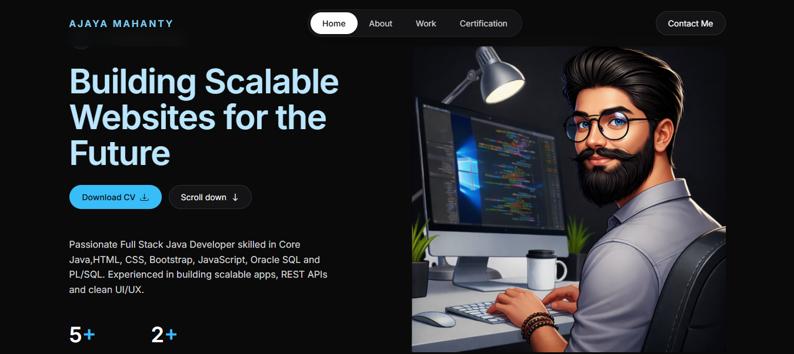

# 🌐 Personal Portfolio Website

<div align="center">

### A modern and responsive portfolio website built with HTML, CSS, Bootstrap, and JavaScript


[🚀 Live Demo](https://ajaya68.github.io/ajaya-portfolio-website/) • [📂 Repository](https://github.com/Ajaya68/ajaya-portfolio-website)

</div>

---

## 📌 About The Project

This is my personal portfolio website designed to showcase my skills, projects, experience, and contact information. The website features a clean, modern interface with responsive layouts that provide a smooth experience across desktop, tablet, and mobile devices.

---

## 📸 Screenshot

### 🏠 Home Page



---

## ✨ Features

* 🎨 Modern and attractive UI design
* 📱 Fully responsive layout
* ⚡ Smooth scrolling navigation
* 🧑‍💻 About me and skills section
* 📂 Project showcase section
* 📄 Resume download section
* 📧 Contact section
* 🔥 Interactive effects using JavaScript
* 🌐 Cross-browser compatibility

---

## 🛠️ Technologies Used

* HTML5
* CSS3
* Bootstrap 5
* JavaScript (ES6)

---

## 📁 Project Structure

```text
portfolio-website/
├── public/
│   ├── docs/
│   └── images/
├── src/
│   ├── scripts/
│   │   └── script.js
│   └── styles/
│       └── style.css
├── index.html
└── README.md
```

---

## 🚀 Getting Started

### Clone the repository

```bash
git clone https://github.com/Ajaya68/ajaya-portfolio-website.git
```

### Run the project

1. Clone or download the repository.
2. Open `index.html` in your browser.

---

## 🎯 Future Enhancements

* 🌙 Add dark/light mode toggle
* 📬 Integrate a backend for the contact form
* 🎞️ Improve animations and transitions
* 📝 Add a blog section

---

## 🤝 Connect With Me

* LinkedIn: https://linkedin.com/in/ajaya-mahanty
* GitHub: https://github.com/Ajaya68
* Email: [ajayafullstackdev@gmail.com](mailto:ajayafullstackdev@gmail.com)

---

⭐ If you like this project, don't forget to give it a star on GitHub!
